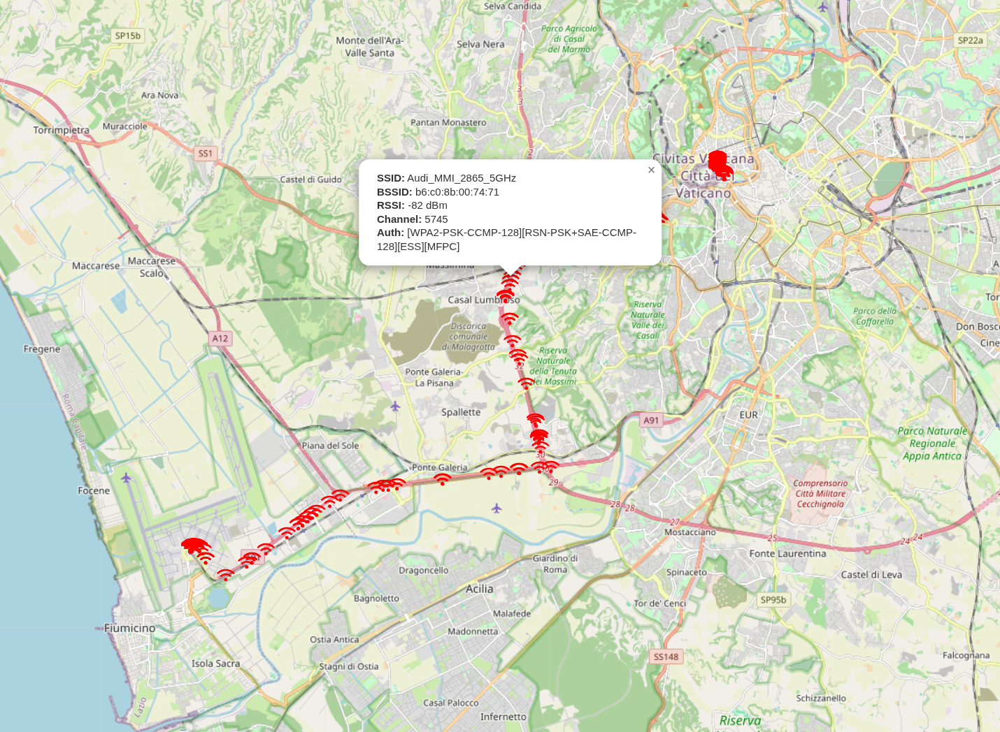

# wigle-sqlite-visualiser

## Description
[WiGLE](https://www.wigle.net/) is a huge database of 802.11 wireless networks, with statistics, submitted by wardrivers, netstumblers, and net huggers. 

Wigle Android application allows to export your local database to sqlite format. This project creates HTML and JSON files to visualise it by running simple HTTP server on 8000 port.


## How To Use
1. Export sqlite to HTML and JSON files
```bash
python wiggle-sqlite-map.py
```

2. Run HTTP server to open mapdata.html and visualise wifi_data.json
```bash
./run-server-with-browser.py
```

## Samples
You can find sample sqlite database in ./db/ directory.


